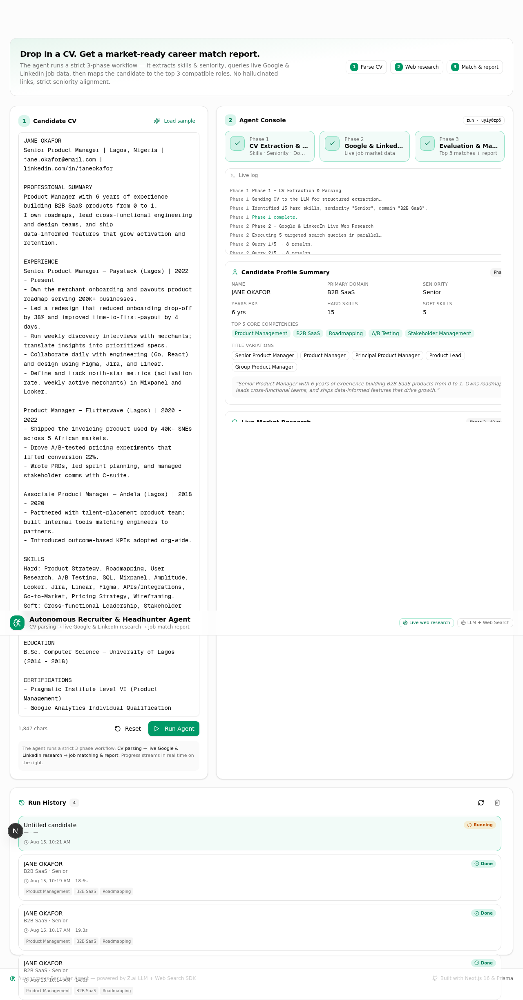

# 🤖 Autonomous Recruiter & Headhunter AI Agent

An autonomous AI agent that parses a candidate's CV (PDF upload or pasted text), runs live Google & LinkedIn market research, and maps them to the top 3 compatible job roles — producing a strategic career-match report.



## ✨ Features

- **PDF Upload** — Upload a CV as a PDF file; text is extracted server-side automatically
- **Text Paste** — Alternatively paste raw CV text directly
- **3-Phase AI Pipeline** — Structured extraction → live web research → job matching
- **Real-Time Streaming** — Watch each phase execute live via Server-Sent Events
- **Run History** — All past analyses are saved and can be revisited
- **Report Export** — Copy or download the final report as Markdown

## How It Works

The agent executes a strict **3-phase pipeline**:

| Phase | Name | Description |
|-------|------|-------------|
| **1** | CV Extraction & Parsing | Sends the raw CV to an LLM to extract a structured profile: skills, seniority, domain, years of experience, title variations, and industry keywords |
| **2** | Google & LinkedIn Live Web Research | Builds targeted search queries (e.g. `site:linkedin.com/jobs "Senior Product Manager" "SaaS"`) and runs them in parallel |
| **3** | Evaluation & Mapping | Synthesises the profile + live search results into a **Career Match Report** with top 3 job matches, market demand analysis, and resume recommendations |

All 3 phases stream progress in real time via Server-Sent Events (SSE).

## Tech Stack

- **Framework:** Next.js 16, React 19, TypeScript
- **AI:** LLM chat completions + web search (provider-agnostic via `ai-client.ts`)
- **Database:** SQLite via Prisma
- **PDF Parsing:** `pdf-parse` (server-side text extraction)
- **UI:** Tailwind CSS 4, shadcn/ui (Radix), Framer Motion
- **Streaming:** SSE for real-time progress updates

## Getting Started

### Prerequisites

- [Node.js](https://nodejs.org/) v18+ or [Bun](https://bun.sh/) v1.0+
- An API key for your chosen LLM provider

### Setup

1. **Clone the repository**
   ```bash
   git clone <repo-url>
   cd <project-folder>
   ```

2. **Install dependencies**
   ```bash
   bun install
   # or: npm install
   ```

3. **Configure environment variables**
   ```bash
   cp .env.example .env
   ```
   Edit `.env` and set:
   ```env
   DATABASE_URL=file:./db/custom.db
   # Add your LLM provider API key
   ```

4. **Set up the database**
   ```bash
   bunx prisma generate
   bunx prisma db push
   ```

5. **Start the dev server**
   ```bash
   bun run dev
   ```
   Open [http://localhost:3000](http://localhost:3000)

## Usage

1. **Upload a PDF** or paste CV text into the input area (or click **Load Sample** for a demo)
2. Click **Run Agent**
3. Watch the 3-phase pipeline execute in real time
4. Review the generated career-match report
5. Copy or download the report as `.md`

## Project Structure

```
├── prisma/schema.prisma              # Database schema (AgentRun model)
├── src/
│   ├── app/
│   │   ├── page.tsx                  # Main page with hero + RecruiterConsole
│   │   ├── layout.tsx                # Root layout with fonts + toaster
│   │   └── api/recruiter/
│   │       ├── run/route.ts          # POST — stream agent execution via SSE
│   │       ├── parse-pdf/route.ts    # POST — PDF upload & text extraction
│   │       ├── runs/route.ts         # GET/DELETE — list/clear run history
│   │       └── runs/[id]/route.ts    # GET/DELETE — single run detail
│   ├── lib/agent/
│   │   ├── ai-client.ts              # Provider-agnostic AI client abstraction
│   │   ├── recruiter-agent.ts        # Core 3-phase agent orchestrator
│   │   ├── prompts.ts                # LLM system/user prompt templates
│   │   └── types.ts                  # TypeScript interfaces
│   ├── components/recruiter/
│   │   ├── recruiter-console.tsx     # Main interactive console UI
│   │   ├── stepper.tsx               # 3-phase progress stepper
│   │   ├── report-view.tsx           # Markdown report renderer
│   │   ├── run-history.tsx           # Run history sidebar
│   │   └── sample-cv.ts             # Demo CV data
│   └── hooks/
│       └── use-recruiter-agent.ts    # React hook driving SSE streaming
├── .env.example                      # Environment template
└── .env                              # Environment config (not committed)
```

## License

MIT
